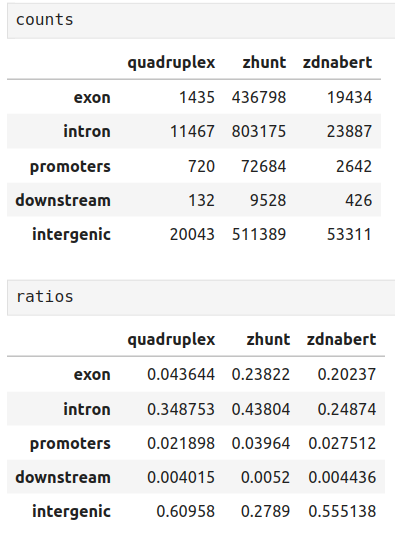
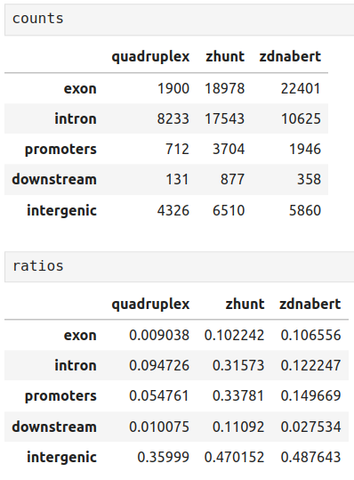

# hse25_bioinf_project

Организм: Spodoptera exigua

Геном по ссылке https://ftp.ncbi.nlm.nih.gov/genomes/all/GCA/902/829/305/GCA_902829305.4_PGI_SPEXI_v6/

Свекольная совка — широко распространённый многоядный вредитель сельскохозяйственных культур, встречается в Европе, Азии, Африке, Австралии и Северной Америке. Личинки питаются более чем 170 видами растений из 35 семейств, включая сахарную свёклу, хлопчатник, томаты и кукурузу. Предпочитает тёплый климат с температурой от 15 °C до 40 °C, оптимальные условия для развития наблюдаются при 33 °C. При повышении температуры ускоряется развитие насекомого, сокращается продолжительность всех стадий жизненного цикла. Генетическая структура популяций может изменяться в зависимости от сезона и условий окружающей среды. Например, в северо-восточном Китае были выявлены значительные сезонные генетические различия среди популяций этого вредителя.

Таблица с генами в файле domain_gene_table.csv:

Распределение структур по геному:

По сравнению с фоновым распределением G4‑мотивов в геноме наблюдается сильное обогащение в интергенных (~61 %) и интронных (~35 %) областях при практически полном отсутствии в экзонах и ближних промоторных районах, что указывает на пассивное накопление структур вне трансляционно активных сегментов.

По сравнению с распределением у человека профиль S. exigua всё ещё характеризуется доминированием интергенных мотивов, но с заметным сдвигом: доля в интронах и прилежащих областях (upstream/downstream) оказывается примерно вдвое ниже людской, тогда как в промоторных зонах (upstream) — наоборот, выше, что отражает специфические регуляторные потребности насекомого.

